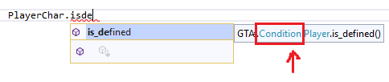

# Условия и циклы

Генератор предусматривает использование условий. Сами конструкции имеют весьма плохой синтаксис и это, наверное, самое больное место генератора.

### Условия IF-THEN-END и IF-THEN-ELSE-END

Sanny Builder позволяет нам использовать конструкции **IF-THEN-END** и **IF-THEN-ELSE-END**. Для реализации условий, генератор имеет две команды: `and` и `or`. Ниже приведён синтаксис написания условий:

```csharp
public class TEST : Thread {

    public override void START( LabelJump label ) {
        wait( 0 );

        Comment = "IF-THEN-END:";
        and( OnMission == 1, delegate {
            jump( START );
        } );

        Comment = "IF_AND-THEN-END:";
        and( OnMission == 0, PlayerActor.is_dead(), delegate {
            jump( START );
        } );

        Comment = "IF-THEN-END:";
        or( OnMission == 1, delegate {
            jump( START );
        } );

        Comment = "IF_OR-THEN-END:";
        or( OnMission == 1, PlayerActor.is_dead(), delegate {
            jump( START );
        } );

        end_thread();
    }

}
```

На выходе мы получим такой код:

```
//------------- THREAD TEST ---------------
:TEST
03A4: name_thread 'TEST'
0001: wait 0 ms

// IF-THEN-END:
00D6: if
0038:     $409 == 1 // $ == ? (int)
then
0002: jump @TEST
end

// IF_AND-THEN-END:
00D6: if and
0038:     $409 == 0 // $ == ? (int)
0118:     actor $3 dead
then
0002: jump @TEST
end
```

Если требуется разветвление (**else**), то вот пример:

```csharp
public class TEST : Thread {

    public override void START( LabelJump label ) {
        wait( 0 );

        Comment = "IF_AND-THEN-ELSE-END:";
        and( OnMission == 1, PlayerChar.is_defined(), delegate {
            jump( START );
        }, delegate {
            PlayerChar.add_money( 2000 );
        } );

        Comment = "IF_OR-THEN-ELSE-END:";
        or( OnMission == 1, PlayerActor.is_entering_vehicle(), delegate {
            jump( START );
        }, delegate {
            PlayerActor.set_max_health( 150 );
        } );

        end_thread();
    }

}
```

Результат этого кода:

```
------------- THREAD TEST ---------------
:TEST
03A4: name_thread 'TEST'
0001: wait 0 ms

// IF_AND-THEN-ELSE-END:
00D6: if and
0038:     $409 == 1 // $ == ? (int)
0256:     player $2 defined
then
0002: jump @TEST
else
0109: player $2 money += 2000
end

// IF_OR-THEN-ELSE-END:
00D6: if or
0038:     $409 == 1 // $ == ? (int)
09DE:     actor $3 entering_car
then
0002: jump @TEST
else
08AF: set_actor $3 max_health_to 150
end

004E: end_thread
```

Как видим, код не удобный и наличие делегатов немного путает. Чтобы не писать каждый раз такие конструкции, я рекомендую использовать [сниппеты](../tools/snippets.md) или код условий перемещать в окно **Панель элементов** Visual Studio (`CTRL+W,X` ; доступно также в меню **Вид->Панель элементов**).


Если мы используем только одно условие, то команды **and** и **or** будут работать одинаково!


### Условия JF

Генератор поддерживает инструкцию **JF**, которая делает переход к метке, если условия не выполнились. Это позволит писать код на более низком уровне в случае необходимости. Для этого используется метод `jf`. Особенностью этого подхода является то, что метод не имеет ограничений на количество условий. Рассмотрим пример использования:

```csharp
public class TEST : Thread {

    public override void START( LabelJump label ) {

        jf( END_SCRIPT, PlayerChar.is_defined(), !PlayerActor.is_dead(), !PlayerActor.is_busted() );

        PlayerChar.add_money( 2000 );
        Jump += END_SCRIPT;
    }

    private void END_SCRIPT( LabelJump label ) {
        end_thread();
    }

}
```

Метод **jf** принимает первым параметром метку, куда будет осуществлён переход, если условия не выполнились. Если игрок найден, не мёртв и не арестован, то игроку дадут 2000$. В итоге будет вот такой код:

```
//------------- THREAD TEST ---------------
:TEST
03A4: name_thread 'TEST'

00D6: if
0256:     player $2 defined
004D: jump_if_false @TEST_LABEL_0

00D6: if
8118: not actor $3 dead
004D: jump_if_false @TEST_LABEL_0

00D6: if
8741: not actor $3 busted
004D: jump_if_false @TEST_LABEL_0

0109: player $2 money += 2000
0002: jump @TEST_LABEL_0

:TEST_LABEL_0
004E: end_thread
```

Недостаток такого подхода в том, что все условия проверяются по очереди, когда можно было некоторые из них объединить. Этот факт я тоже учёл. Метод **and** и **or** имеют перегрузки, которые принимают метку в качестве первого параметра, но исключают возможность использовать **then** и **else** блоков. Рассмотрим следующий пример:

```csharp
public class TEST : Thread {

    public override void START( LabelJump label ) {
	
        jf( END_SCRIPT, PlayerChar.is_defined() );

        and( END_SCRIPT, !PlayerActor.is_dead(), !PlayerActor.is_busted() );

        PlayerChar.add_money( 2000 );
        Jump += END_SCRIPT;
    }

    private void END_SCRIPT( LabelJump label ) {
        end_thread();
    }

}
```

В этом случае сначала будет идти проверка только на существование игрока. Далее уже идут проверки на выполнение всех условий:

```
//------------- THREAD TEST ---------------
:TEST
03A4: name_thread 'TEST'

00D6: if
0256:     player $2 defined
004D: jump_if_false @TEST_LABEL_0

00D6: if and
8118: not actor $3 dead
8741: not actor $3 busted
004D: jump_if_false @TEST_LABEL_0

0109: player $2 money += 2000
0002: jump @TEST_LABEL_0

:TEST_LABEL_0
004E: end_thread
```

На этом возможности **jf** не заканчиваются! Мы можем использовать метод `wait`, где дополнительно указывается набор условий, выполнение которых также нужно ждать:

```csharp
public class TEST : Thread {

    static RadarMarker marker;

    public override void START( LabelJump label ) {
        marker.create_long_range( RadarIconID.CJ, 1400.0, 400.0, 13.0 );

        wait( DefaultWaitTime, // <-- время задержки. Указывать не обязательно
            OnMission == 0,
            PlayerChar.is_defined(),
            !PlayerChar.is_on_jetpack(),
            PlayerActor.is_near_point_3d_on_foot( false, 1400.0, 400.0, 13.0, 0.0, 0.0, 0.0 )
        );

        marker.disable();

        wait( PlayerActor.is_dead() ); // <-- время задержки отсутствует

        end_thread();
    }

}
```

Если мы посмотрим результат, то увидим что у нас генерируются автоматические метки для конструкций **JF**:

```
//------------- THREAD TEST ---------------
:TEST
03A4: name_thread 'TEST'
02A7: $2000 = create_icon_marker_and_sphere 15 at 1400.0 400.0 13.0

:TEST_JF_0
0001: wait $14 ms
00D6: if
0038:     $409 == 0 // $ == ? (int)
004D: jump_if_false @TEST_JF_0
00D6: if
0256:     player $2 defined
004D: jump_if_false @TEST_JF_0
00D6: if
8A0C: not player $2 on_jetpack
004D: jump_if_false @TEST_JF_0
00D6: if
00FF:     actor $3 sphere 0 in_sphere 1400.0 400.0 13.0 radius 0.0 0.0 0.0 on_foot
004D: jump_if_false @TEST_JF_0

0164: disable_marker $2000

:TEST_JF_1
0001: wait 0 ms
00D6: if
0118:     actor $3 dead
004D: jump_if_false @TEST_JF_1

004E: end_thread
```

Обратите внимание ещё на символ `!` возле условий. Если написать его перед условием, то будет осуществлена проверка на ложь, а не на истину. Этакий удобный аналог реверса опкода, который начинается с числа `8` и имеет ключевое слово `not` в описании.

### Циклы

Раз мы перешли к циклам, то давайте рассмотрим их виды. Sanny Builder предоставляет нам 3 вида: **for**, **while** и **repeat**. Все они доступны и в генераторе. Цикл **for** я не смог реализовать нормально, поэтому я разделил его на две отдельные команды `to` и `downto`:

```csharp
public class TEST : Thread {

    Int index = local( 0 ); // 0@
    Float indexFloat = local( 0 ); // 0@

    public override void START( LabelJump label ) {

        // for 0@ = 0 to 10
        to( index, 0, 10, delegate {
            load_model( index );
        } );
        load_requested_models();

        // for 0@ = 4.0 downto 0.0 step 0.25
        downto( indexFloat, 4.0, 0.0, delegate {
            PlayerActor.set_position( 0.0, indexFloat, 13.0 );
        }, 0.25 ); // <- 0.25 - шаг цикла, опциональный параметр

        end_thread();
    }

}
```

Обе команды принимают на вход переменную-счётчик и требуют два параметра: начало и конец. В конце команды можно ещё написать шаг цикла. Третьим параметром требуется указать функцию, которая будет выполняться в цикле. Я использовал там анонимный метод. Если мы скомпилируем этот код, то получим следующее:

```
//------------- THREAD TEST ---------------
:TEST
03A4: name_thread 'TEST'

int 0@ // нужно, если в качестве параметров цикла будут переменные
for 0@ = 0 to 10
0247: load_model 0@
end

038B: load_requested_models

float 0@ // нужно, если в качестве параметров цикла будут переменные
for 0@ = 4.0 downto 0.0 step 0.25
00A1: put_actor $3 at 0.0 0@ 13.0
end

004E: end_thread
```

Что касается циклов **while** и **repeat**, то генератор имеет всего одну команду — `loop`. Какой из циклов будет генерироваться зависит от места, где написано условие. Если нам нужен "бесконечный цикл", то условие не пишем вовсе:

```csharp
public class TEST : Thread {

    public override void START( LabelJump label ) {

        loop( PlayerChar.is_defined(), delegate {
            wait( 0 );
            Comment = "while";
        } );

        loop( delegate {
            wait( 0 );
            Comment = "repeat";
        }, !PlayerChar.is_defined() );

        loop( delegate {
            wait( 0 );
            Comment = "while true";
        } );

        end_thread();
    }

}
```

Здесь кроме условия мы должны написать анонимную функцию. Если условие будет вначале, то будет использоваться **while**. Если в конце — **repeat**. Без условия мы получим **while true**. Этот код буде иметь такой вид на выходе:

```
//------------- THREAD TEST ---------------
:TEST
03A4: name_thread 'TEST'

while 0256:     player $2 defined
0001: wait 0 ms
// while
end

repeat
0001: wait 0 ms
// repeat
until 8256: not player $2 defined

while true
0001: wait 0 ms
// while true
end

004E: end_thread
```

Иногда нам нужно использовать команды **break** и **continue** в циклах. В таких случаях слово **delegate** нужно заменить на **лямбда выражение**. Это даст нам возможность вызвать требуемые команды:

```csharp
public class TEST : Thread {

    public override void START( LabelJump label ) {

        loop( l => { // лямбда выражение
            wait( 0 );
            and( !PlayerChar.is_defined(), delegate {
                l.@break();
            } );
            l.@continue();
            Comment = "break and continue";
        } );

        end_thread();

    }

}
```

Результат:

```
//------------- THREAD TEST ---------------
:TEST
03A4: name_thread 'TEST'

while true
0001: wait 0 ms

00D6: if
8256: not player $2 defined
then
break
end

continue
// break and continue
end

004E: end_thread
```

У нас есть возможность также сделать цикл, который чем-то похож на **jf**, только без условий (так называемый цикл на метках). Он реализуется с помощью события `Cycle`. Он не делает никаких прыжков и печатает его сразу после команды, которая была до него:

```csharp
public class TEST : Thread {

    public override void START( LabelJump label ) {
        Cycle += TEST_LABEL_LOOP;
    }

    private void TEST_LABEL_LOOP() {
        wait( 0 );
        and( PlayerChar.is_defined(), delegate {
            Jump += END_SCRIPT;
        } );
        Comment = "LOOP FOR LABEL";
    }

    private void END_SCRIPT( LabelJump label ) {
        end_thread();
    }

}
```

Событие **Cycle** создаст автоматическую метку. В анонимной функции указывается код, который будет выполнятся в цикле. В результате мы будем иметь это:

```
//------------- THREAD TEST ---------------
:TEST
03A4: name_thread 'TEST'

:TEST_CYCLE_0
0001: wait 0 ms
00D6: if
0256:     player $2 defined
then
0002: jump @TEST_LABEL_0
end
// LOOP FOR LABEL
0002: jump @TEST_CYCLE_0

:TEST_LABEL_0
004E: end_thread
```

Кроме этого, мы можем использовать циклы C#, чтобы генерировать код для **main.scm**:

```csharp
public class TEST : Thread {

    public override void START( LabelJump label ) {

        // создаём  C#-массив, который будем перебирать через циклы C#
        VehicleModel[] ids = new VehicleModel[ 3 ] { VehicleModel.ADMIRAL, VehicleModel.NEBULA, VehicleModel.PEREN };

        foreach( var item in ids ) {
            load_model( item );
        }

        load_requested_models();
        wait( DefaultWaitTime );

        for( int i = 0; i < ids.Length; i++ ) {
            destroy_model( ids[ i ] );
        }

        end_thread();
    }

}
```

Этот приём не создаст никаких циклов и будет генерировать всё последовательно. Его лучше использовать тогда, когда у нас есть данные, которые нельзя как-то упорядочить. Вот результат:

```
//------------- THREAD TEST ---------------
:TEST
03A4: name_thread 'TEST'
0247: load_model 445
0247: load_model 516
0247: load_model 404
038B: load_requested_models
0001: wait $14 ms
0249: release_model 445
0249: release_model 516
0249: release_model 404
004E: end_thread
```

Если возвращаться к условиям, то все условия возвращают тип `Condition`. Проверить какая команда является условием можно через подсказку Visual Studio: &#x20;



Если написать команду вне блока условий или цикла, то генератор ничего не напишет. Например, это будет проигнорировано:

```csharp
public class TEST : Thread {

    public override void START( LabelJump label ) {
        ini_write_int( 25, "CLEO/INI", "SECTION", "KEY" ); <-- не будет генерироваться
        end_thread();
    }

}
```

В основном это связано с оптимизацией генерации: сначала собираем все условия, а только потом "печатаем" их. Циклы и условия делают это автоматически, но для ручного вызова условной команды требуется вызвать метод `write`:

```csharp
public class TEST : Thread {

    public override void START( LabelJump label ) {

        ini_write_int( 25, "CLEO/INI", "SECTION", "KEY" ).write();

        ( !PlayerChar.is_defined() ).write();

        end_thread();
    }

}
```

Поверку на ложь нужно взять в скобки, так как метод **write** ничего не возвращает. На выходе мы получим уже такое:

```
//------------- THREAD TEST ---------------
:TEST
03A4: name_thread 'TEST'
0AF1: write_int 25 to_ini_file "CLEO/INI" section "SECTION" key "KEY" // IF and SET
8256: not player $2 defined
004E: end_thread
```

Если команда у Вас не выводится, проверьте не является ли она условием. Такое решение было принято с теми соображениями, что некоторые опкоды можно использовать как условие и как процедуру.


Чтобы не играться с **write** в ini-файлах, используйте класс **Ini**.

