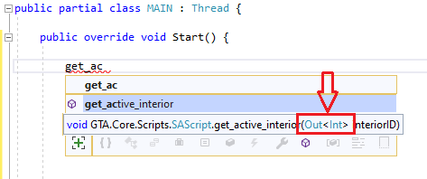

# Метки, переходы, опкоды

### Jump и Gosub

Переходы совершаются с помощью событий `Jump` и `Gosub`. Мы сможем сделать переход на автоматическую метку и выполнить код, указанный в событии. Метод должен возвращать тип **void** и принимать 1 параметр из семейства типов **BaseLabel**:

```csharp
public partial class MAIN : Thread {

    public override void START( LabelJump label ) {
        Gosub += GOSUB_1;
        Jump += JUMP_1;
    }

    private void JUMP_1( LabelJump label ) {
        Comment = "jump #1";
        wait( 0 );
        Jump += JUMP_1;
    }

    private void GOSUB_1( LabelGosub label ) {
        Comment = "gosub #2";
    }

}
```

Методы **JUMP\_1** и **GOSUB\_1** описывают поведение кода при переходе на метку. Саму метку описывает параметр `label`. Тип данных метки варьируется в зависимости от типа перехода, а сам параметр в методе содержит описание метки, которую мы можем использовать при переходах или условиях. Мы получим следующий код на выходе:

```
//------------- THREAD MAIN ---------------
:MAIN
03A4: name_thread 'MAIN'
0050: gosub @MAIN_GOSUB_0
0002: jump @MAIN_LABEL_0

:MAIN_GOSUB_0
// gosub #2
0051: return

:MAIN_LABEL_0
// jump #1
0001: wait 0 ms
0002: jump @MAIN_LABEL_0
```

Для удобства лучше переименовать методы. При повторной подписке на событие, прыжок будет осуществлён ещё раз на указанную метку, не создавая другую.


Названия методов не надо писать вручную! После символов **+=** нажимаем волшебную клавишу **TAB** и Visual Studio сделает это за нас!


Кроме этого есть методы `jump` и `gosub`, которые делают переходы подобно событию:

```csharp
public partial class MAIN : Thread {

    public override void START( LabelJump label ) {
        gosub( GOSUB_1 );
        jump( JUMP_1 );
    }

    private void JUMP_1( LabelJump label ) {
        Comment = "jump #1";
        wait( 0 );
        jump( label ); // <-- ТАК ТОЖЕ МОЖНО
    }

    private void GOSUB_1( LabelGosub label ) {
        Comment = "gosub #2";
    }

}
```

Метод **jump** также может принимать в параметры типы семейства `LabelJump` и переменные типа `Memory` (если установить значение через свойство **label**).&#x20;


Переход **Gosub** автоматически генерирует **return** в конце кода!


### Запуск потоков

Также мы можем запускать потоки, как это делается в Sanny Builder. Для этого есть команды `create_thread()` и `create_thread_wb()`:

```csharp
public partial class MAIN : Thread {

    public override void START( LabelJump label ) {

        create_thread<TEST1>(); // без параметров
        create_thread<TEST2>( 10, 20, -1, 0.0 ); // с параметрами
        create_thread_wb<TEST3>(); // всегда без параметров

        end_thread();
    }

}

public class TEST1 : Thread {

    public override void START( LabelJump label ) {
        end_thread();
    }

}

public class TEST2 : Thread {

    public override void START( LabelJump label ) {
        end_thread();
    }

}

public class TEST3 : Thread {

    public override void START( LabelJump label ) {
        end_thread();
    }

}
```

Это приводит к такому результату:

```
//------------- THREAD MAIN ---------------
:MAIN
03A4: name_thread 'MAIN'

004F: create_thread @TEST1
004F: create_thread @TEST2 10 20 -1 0.0
00D7: create_thread_wb @TEST3
004E: end_thread

//------------- THREAD TEST1 ---------------
:TEST1
03A4: name_thread 'TEST1'
004E: end_thread

//------------- THREAD TEST2 ---------------
:TEST2
03A4: name_thread 'TEST2'
004E: end_thread

//------------- THREAD TEST3 ---------------
:TEST3
03A4: name_thread 'TEST3'
004E: end_thread
```

Обратите внимание, что сами потоки мы указываем в треугольных скобках, как это делалось в главе [Установка и настройка](../../settings.md). Код потоков будет генерироваться только после использования команд **create\_thread** и **create\_thread\_wb** и будет делать это в том порядке, в котором они были вызваны.

### Опкоды

Сейчас я расскажу про опкоды. Их нету в генераторе, как таковых. На их месте, как уже многие догадались, используются методы (команды). Некоторые из них Вы уже узнали, если пользовались Sanny Builder. Некоторые были добавлены специально для реализации определённых синтаксических конструкций. Главное преимущество генератора состоит в том, что в C# строгая типизация. Это позволяет лучше контролировать данные, которые требуют команды, и избегать ошибок связанных с ними. Мы можем передавать значения как переменной, так и литералом:

```csharp
wait( 1000 );
wait( DefaultWaitTime );
```

Некоторые параметры имеют особую маркировку. Например: &#x20;



Тип `Out<T>` говорит о том, что параметр требует переменную, а не литерал. Если записать вот так:

```csharp
get_active_interior( 2 );
```

то генератор выдаст ошибку, что контекст параметра не определён. Если записать вот так:

```csharp
Int variableName = local();
get_active_interior( variableName );
```

то компиляция будет успешной, так как переменная была декларирована ранее. Главная особенность этого типа в том, что он проверяет наличие переменной с локальным или глобальным контекстом. Тип внутри символов `<` и `>` указывает подходящий тип данных для конкретного случая.

Названия параметров также имеют другие маркировки. Обычно к названию параметра прибавляется определённый суффикс:

| Маркировка | Описание                                              |
| ---------- | ----------------------------------------------------- |
| **\_bool** | Значение `1`, `0`, `true` или `false`.                |
| **\_byte** | Значение от `0` до `255`, но не всегда весь диапазон. |

Про миссии и внешние скрипты есть отдельные главы, где они рассмотрены более детально.
