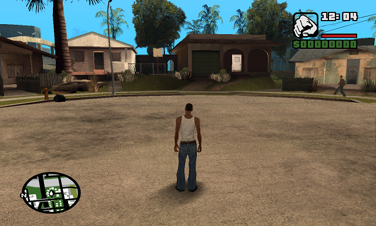

# Переменные, типы данных

Sanny Builder даёт возможность использовать тип данных как переменную класса, но их количество ограниченно и приходилось вручную писать классы и их методы. Генератор же использует все типы данных и сейчас мы научимся их создавать.

Начну с простых вещей. Типы условно можно разделить на числовые и строковые. Они описывают данные переменных, которые могут быть локальными или глобальными. Если в Sanny Builder нам достаточно было использовать символы **@** и **$** чтобы указать локальная переменная или нет, то в генераторе этот механизм совсем иной. Сначала нужно объявить переменную.

### Инициализация

Начиная с версии 7.0, нам уже не нужно предварительно инициализировать переменные. Это происходит автоматически в таком порядке: слева на право и сверху вниз. Это происходит только в том случае, если они небыли инициализированы ранее. Пример такой инициализации:

```csharp
public partial class MAIN : Thread {

    static Int myGlobalVariable1, myGlobalVariable2; // $2000, $2001
	
    Int myLocalVariable1, myLocalVariable2; // 0@, 1@

    public override void START( LabelJump label ) {
        end_thread();
    }

}
```

Всё, что помечено ключевым словом `static` при такой инициализации будет воспринято генератором как глобальная переменная. Это будет эквивалентно следующему коду:

```csharp
public partial class MAIN : Thread {

    static Int myGlobalVariable1 = global(), // $2000
               myGlobalVariable2 = global(); // $2001
	
    Int myLocalVariable1 = local(), // 0@
        myLocalVariable2 = local(); // 1@

    public override void START( LabelJump label ) {
        end_thread();
    }

}
```

Если использовать команды `local` и `global`, то переменная получит контекст независимо от использования ключевого слова **static**. Такое использование позволяет инициализировать переменную где угодно. Например, внутри метода:

```csharp
public partial class MAIN : Thread {

    public override void START( LabelJump label ) {

        Int myGlobalVariable1 = global(); // $2000
        Int myLocalVariable1 = local(); // 0@

        end_thread();
    }

}
```

До этого мы рассматривали примеры, когда переменные получали номера автоматически. Но я оставил возможность явно указывать какой номер будет использоваться при инициализации. Подход применяется в случае, когда лимит исчерпан и нужно перезаписать существующую переменную. Пример:

```csharp
public partial class MAIN : Thread {

    Int myLocalVariable1 = local( 0 ), // 0@
        myLocalVariable2 = local();    // 0@

    public override void START( LabelJump label ) {
        end_thread();
    }

}
```

Переменные **myLocalVariable1** и **myLocalVariable2** будут ссылаться на один и тот же номер. При этом мы можем указывать разные типы. Недостатком такого подхода будет контроль за номерами — нам нужно точно знать какой номер получила автоматическая переменная, чтобы потом явно его указать.


Типы **sString** и **vString** в библиотеках GTA.III и GTA.VC номер не получают, так как в скриптах не предусмотрено использование строк в качестве переменных! Они декоративные.



Типы **sString** и **vString** в библиотеке GTA.SA делают сдвиг номера, так как они занимают больше места, чем остальные типы данных! Это затруднит поиск номера при явном указании переменной.


### Установка числовых значений

Установка значения происходит путём вызова свойства `value`, что не совсем удобно. Это связано как с ограничениями языка программирования, так и с передачей параметров в методы. Поскольку в C# строгая типизация, то задавать значения можно только переменные одного типа. Для чисел и строк существует больше вариантов установки значений. Давайте рассмотрим пример:

```csharp
public partial class MAIN : Thread {

    static Int integer1, integer2; // глобальные переменные
    static Float float1;           // глобальная переменная
    static Car car1, car2;         // глобальные переменные

    Float float2;                  // локальная переменная
    sString shortStr1, shortStr2;  // локальные переменные
    vString longStr1, longStr2;    // локальные переменные

    public override void START( LabelJump label ) {

        integer1.value = 0x25;             // установка значения целого числа в шестнадцатеричной системе счисления
        integer1.value = 10;               // установка значения целого числа в десятичной системе счисления
        integer1.value = true;             // устновка значения типа bool
        integer1.value = CarModel.ADMIRAL; // установка значения типа Enum
        integer2.value = integer1;         // установка значения другой переменной

        float1.value = 20.0;               // установка значения дробного числа
        float1.value = -10;                // установка целого числа, которое будет преобразовано в дробное
        float2.value = float1;             // установка значения другой переменной

        shortStr1.value = "DUMMY";         // только в режиме GTA SA. 7 символов максимум
        shortStr2.value = shortStr1;       // установка значения другой переменной

        longStr1.value = "Demo_string";    // только в режиме GTA SA. Количество символов зависит от опкода
        longStr2.value = longStr1;         // установка значения другой переменной

        car1.value = car2;                 // установка значения другой переменной для всех остальных типов
		
        end_thread();
    }

}
```

Как видим, нет ничего страшного в использовании **value**. Отдельно хотелось обратить внимание, что строки не имеют привязки к конкретному виду кавычек. Все они пишутся в двойных. Генератор будет использовать те, что закреплены в Sanny Builder. Если длина строки не будет соответствовать своему типу, то генератор сообщит об ошибке.

C#, конечно, позволяет устанавливать значения переменным через символ `=`. Но в контексте генератора использовать его **НЕ СТОИТ**! Суть в том, что C# устанавливает новую ссылку или значение (делает копию, грубо говоря). Генератор не может перехватить эту процедуру из за ограничений языка программирования.

Давайте рассмотрим пример того, как **НЕ СТОИТ** делать:

```csharp
public partial class MAIN : Thread {

    public override void START( LabelJump label ) {

        Int score = 7; // НЕ НАДО ТАК!

        Int counter = local(); // 0@
        Int total = global(); // $2000

        counter = total; // НЕ НАДО ТАК!
        counter += 25;

        end_thread();
    }

}
```

Каков результат? Вот:

```
//------------- THREAD MAIN ---------------
:MAIN
03A4: name_thread 'MAIN'

0008: $2000 += 25 // $ += ? (int)

004E: end_thread
```

В коде мы чётко указали, что **counter** является локальной переменной. Но в результате мы увидели, что используется переменная **total**. Выражение `counter = total` заставило **counter** взять ссылку на **total**. Поэтому, если нужно записать значение **total** в переменную **counter**, используем свойство `value`:

```csharp
public partial class MAIN : Thread {

    public override void START( LabelJump label ) {

        Int score = 7; // НЕ НАДО ТАК!

        Int counter = local(); // 0@
        Int total = global(); // $2000

        counter.value = total; // ПРАВИЛЬНО!
        counter += 25;

        end_thread();
    }

}
```

Осталось разобраться с переменной **score**. Что с ней "не так"? Переменные могут быть параметрами опкодов, поэтому генератор и C# позволяют делать подобную запись. Вся "соль" в том, что переменная **score** не будет иметь контекста (то есть не будет локальной или глобальной). Это значит, что все команды типа **Int** не будут правильно работать, так как нет опкода, который записывал бы значение в литерал. Следующий код будет генерировать ошибку:

```csharp
public partial class MAIN : Thread {

    public override void START( LabelJump label ) {

        Int score = 7; // НЕ НАДО ТАК!
        score += 3;    // ????: 7 += 3
		
        end_thread();
    }

}
```

Решением будет использовать методы `local` или `global`:

```csharp
public partial class MAIN : Thread {

    public override void START( LabelJump label ) {

        Int score = local(); // ПРАВИЛЬНО!
        score.value = 7; // ПРАВИЛЬНО!
        score += 3;
		
        end_thread();
    }

}
```

Результат:

```
//------------- THREAD MAIN ---------------
:MAIN
03A4: name_thread 'MAIN'

0006: 0@ = 7 // @ = ? (int)
000A: 0@ += 3 // @ += ? (int)

004E: end_thread
```

В библиотеках **GTA.III** и **GTA.VC** строки могут без ограничений использовать прямую инициализацию, так как типы данных строк представлены только в виде литералов. Следующий код не будет вызывать проблем:

```csharp
public partial class MAIN : Thread {

    public override void START( LabelJump label ) {
	
        sString shortStr1 = "GXTNAME";    // НОРМАЛЬНО!
        vString longStr1 = "Demo_string"; // НОРМАЛЬНО!

        end_thread();
    }

}
```

### Арифметические операции

Некоторые типы данных поддерживают арифметические операции. Я рекомендую использовать их по очереди, хоть генератор позволяет нам делать сложные конструкции:

```csharp
public partial class MAIN : Thread {

    Int myInt;     // 0@
    Float myFloat; // 1@

    public override void START( LabelJump label ) {

        myInt.value = 0;
        myFloat.value = 0.0;

        Comment = "easy construction:";

        myInt += 2;
        myFloat -= 4.0;
        myInt /= 4;
        myFloat *= 6.0;

        Comment = "difficult construction:";

        Int myInt2 = local(); // 2@
        myInt2.value = 10;

        myInt += ( myInt + myInt2 / myInt2 - myInt );

        end_thread();
    }

}
```

Использование сложных конструкций часто приводит к непредсказуемым результатам, поэтому лучше не использовать их вовсе. Вот результат:

```
//------------- THREAD MAIN ---------------
:MAIN
03A4: name_thread 'MAIN'

0006: 0@ = 0 // @ = ? (int)
0007: 1@ = 0.0 // @ = ? (float)

// easy construction:
000A: 0@ += 2 // @ += ? (int)
000F: 1@ -= 4.0 // @ -= ? (float)
0016: 0@ /= 4 // @ /= ? (int)
0013: 1@ *= 6.0 // @ *= ? (float)

// difficult construction:
0006: 2@ = 10 // @ = ? (int)
0072: 2@ /= 2@ // @ /= @ (int)
005A: 0@ += 2@ // @ += @ (int)
0062: 0@ -= 0@ // @ -= @ (int)
005A: 0@ += 0@ // @ += @ (int)

004E: end_thread
```

Обратите внимание, что дробные числа записываются без каких либо суффиксов (`F` или `f` в C#). Это связано с тем, что фактически используется тип `double`, а не **float**. Также генератор чувствителен к типам. Если Sanny Builder мог позволить записать в переменную типа **Int** дробное значение, то генератор этого не позволит сделать. Это нужно для контроля типов. Другими словами: чтобы не допускать логических ошибок, которые приводят к неожиданным результатам уже в игре.


Мы можем задавать дробному типу значения целого числа. Генератор сам преобразует его в дробный вид.


### Встроенные переменные

Класс **Thread** (и другие подобные ему классы) имеет в своём составе некоторые переменные, которые можно использовать не инициализируя их. Таблица с именами находится в конце раздела. Давайте создадим игрока, дадим одежду и контроль (для GTA III и VC код будет немного другим):

```csharp
public partial class MAIN : Thread {

    public override void START( LabelJump label ) {
        fade( false, 0 );
        refresh_game_renderer( 2488.562, -1666.865 );
        CAMERA.refresh( 2488.562, -1666.865, 13.3757 );

        PlayerChar.create( 2488.562, -1666.865, 12.8757 );
        PlayerChar.can_move( false );
        PlayerChar.get_actor( PlayerActor );
        PlayerChar.get_group( PlayerGroup );
        PlayerActor.set_z_angle( 262.0 );
        CAMERA.set_behind_player();

        PlayerChar.set_clothes( "VEST", "VEST", ClothesBodyPart.TORSO );
        PlayerChar.set_clothes( "JEANSDENIM", "JEANS", ClothesBodyPart.LEGS );
        PlayerChar.set_clothes( "SNEAKERBINCBLK", "SNEAKER", ClothesBodyPart.SHOES );
        PlayerChar.set_clothes( "PLAYER_FACE", "HEAD", 1 );
        PlayerChar.rebuild(); // Player.Build
        save_player_clothes();

        wait( 1000 );
        release_weather();
        fade( 1, 1000 );
        PlayerChar.can_move( 1 );

        end_thread();
    }

}
```

Многие названия опкодов были переименованы согласно оригиналу, но обычно они не так часто используются. Для аргументов команд есть альтернативные значения — перечисления (для удобства). В примере выше я использовал перечисление `ClothesBodyPart`, которое хранит номера частей тела игрока. Таких перечислений много. Обычно они имеют такое же название как и имя аргумента команды. Если мы скомпилируем этот код, то у нас будет такой скрипт:

```
DEFINE OBJECTS 0

DEFINE MISSIONS 0

DEFINE EXTERNAL_SCRIPTS 0 // Use -1 in order not to compile AAA script

DEFINE UNKNOWN_EMPTY_SEGMENT 0

DEFINE UNKNOWN_THREADS_MEMORY 2048

//------------- THREAD MAIN ---------------
:MAIN
03A4: name_thread 'MAIN'
0180: set_on_mission_flag_to $409 // Note: your missions have to use the variable defined here
0111: set_wasted_busted_check 0
0004: $14 = 250 // $ = ? (int)
//===== EXTERNAL SCRIPT NOT FOUND =====\\
016A: fade 0 time 0
04E4: refresh_game_renderer_at 2488.562 -1666.865
03CB: set_rendering_origin_at 2488.562 -1666.865 13.3757
0053: $2 = create_player 0 at 2488.562 -1666.865 12.8757
01B4: set_player $2 can_move 0
01F5: $3 = get_player_actor $2
07AF: $11 = player $2 group
0173: set_actor $3 z_angle_to 262.0
0373: set_camera_directly_behind_player
087B: set_player $2 clothes_texture "VEST" model "VEST" body_part 0
087B: set_player $2 clothes_texture "JEANSDENIM" model "JEANS" body_part 2
087B: set_player $2 clothes_texture "SNEAKERBINCBLK" model "SNEAKER" body_part 3
087B: set_player $2 clothes_texture "PLAYER_FACE" model "HEAD" body_part 1
070D: rebuild_player $2
0793: save_player_clothes
0001: wait 1000 ms
01B7: release_weather
016A: fade 1 time 1000
01B4: set_player $2 can_move 1
004E: end_thread
```

Если скомпилировать в Sanny Builder, то в игре мы уже сможем управлять игроком и делать прочие базовые вещи: &#x20;



Напоследок ещё расскажу о механизме вызовов методов. Нам не обязательно каждый раз писать имя переменной перед командой. Методы типов данных возвращают ссылку на переменную. Мы можем это использовать для реализации так называемой **цепочки**.Это будет выглядеть так:

```csharp
PlayerChar.create( 2488.562, -1666.865, 12.8757 ).get_actor( PlayerActor ).get_group( PlayerGroup );
```


Названия типов данных ВСЕГДА пишутся с прописной буквы! "Int" и "int" — это разные вещи.


### Глобальные переменные между скриптами

Начиная с версии 5.0 нельзя получать доступ к полям единого класса. Это приводит к тому, что мы не можем использовать общие переменные. Решением будет использовать переменные с модификатором `static`. Чтобы упростить доступ, можно все классы скриптов писать внутри класса **MAIN**. Для этого я как раз использовал модификатор `partial` класса **MAIN** в этих примерах. Вот пример того, как организовать глобальный доступ:

```csharp
public partial class MAIN : Thread { // partial позволяет "разбить" класс на несколько файлов

    static Int MyGlobalVariable; // static гарантирует доступ к переменной с других классов

    public override void START( LabelJump label ) {
        end_thread();
    }

}


public partial class MAIN {

    public class TEST : Thread {

        public override void START( LabelJump label ) {

            MyGlobalVariable.value = 25;

            end_thread();
        }

    }

}
```

Таким образом, мы можем обеспечить глобальный доступ между классами.

### Базовые типы данных

| Тип                                                                                                                                                                                                                               |  SA |  VC | III |
| --------------------------------------------------------------------------------------------------------------------------------------------------------------------------------------------------------------------------------- | :-: | :-: | :-: |
| **Числа**                                                                                                                                                                                                                         |     |     |     |
| Int, Float, Timer, StatusText, Memory                                                                                                                                                                                             |  +  |  +  |  +  |
| **Строки**                                                                                                                                                                                                                        |     |     |     |
| sString, vString                                                                                                                                                                                                                  |  +  |     |     |
| **Остальные**                                                                                                                                                                                                                     |     |     |     |
| Actor, Boat, Car, CashPickup, Checkpoint, File, Fire, Library, Marker, Object, Pickup, Player, RadarMarker, Sphere                                                                                                                |  +  |  +  |  +  |
| Garage, Phone, Sound                                                                                                                                                                                                              |     |  +  |  +  |
| ObjectPath                                                                                                                                                                                                                        |     |  +  |     |
| AssetMoneyPickup, Heli, Plane, Bike                                                                                                                                                                                               |  +  |  +  |     |
| Array, ASPack, Attractor, AudioStream, AudioStream3D, Cab, CarComponent, Carriage, ColorPanel, DecisionMaker, EntranceMarker, Group, GroupDecisionMaker, Panel, Particle, RaceCheckpoint, SearchFile, Searchlight, Trailer, Train |  +  |     |     |

### Вспомогательные типы данных

| Тип                          | SA | VC | III |
| ---------------------------- | -- | -- | --- |
| **Декоративные типы**        |    |    |     |
| sString, vString             |    | +  | +   |
| **Классы-одиночки**          |    |    |     |
| CAR\_PARK, DRAW, CAMERA, FXT | +  | +  | +   |
| **Статические классы**       |    |    |     |
| Model, Ini                   | +  | +  | +   |
| Garage                       | +  |    |     |

### Переменные по умолчанию

| Имя                                                  | Тип    | SA | VC | III |
| ---------------------------------------------------- | ------ | -- | -- | --- |
| OnMission, DefaultWaitTime, LocalTimer1, LocalTimer2 | Int    | +  | +  | +   |
| PlayerChar                                           | Player | +  | +  | +   |
| PlayerActor                                          | Actor  | +  | +  | +   |
| PlayerGroup                                          | Group  | +  |    |     |
