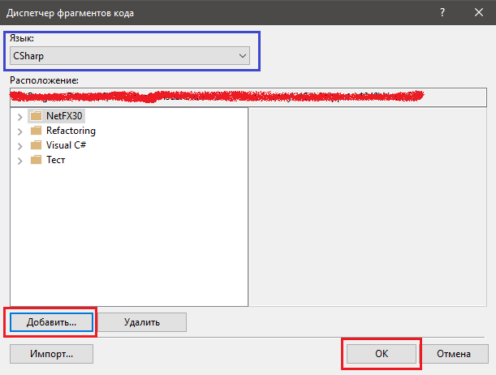

# Сниппеты

Снипетты — это фрагменты кода, которые можно вставить путём двух нажатий клавиши `TAB` в Visual Studio. Кроме стандартных сниппетов существует возможность добавить собственные фрагменты, которые позволят ускорить процесс разработки. Специально для генератора я разработал небольшой архив с фрагментами кода, который поможет разрабатывать скрипты быстрее.

Для начала Вам нужно загрузить [архив](http://ru-script.3dn.ru/NO\_DELETE/GTASG\_Snippets.rar) и извлечь папку с файлами в удобное место. Я рекомендую сохранить эти файлы в папке с проектом или в директории со всеми проектами. После этого в Visual Studio ищем нужную функцию в меню `Средства->Диспетчер фрагментов кода`. В появившемся окне выбираем язык и нажимаем на кнопку `Добавить`: &#x20;

После этого достаточно указать путь к папке с новыми сниппетами и нажать `Ок`. Теперь мы можем пользоваться новыми возможностями!

### Использование

Каждый сниппет имеет персональное имя (`Shortcut`). После набора этого имени вы можем воспользоваться клавишей `TAB` (ДВАЖДЫ нажать на кнопку). Когда студия находит сниппет, она делает замену имени на код, который сохранён во фрагменте. Ниже приведён список имён, которые присутствуют в архиве. Вы может их изменить или добавить собственный фрагмент в эту же папку. VS динамически обрабатывает изменения, что позволит Вам легко протестировать новый сниппет.

### Список сниппетов

| #            | Описание                                          |
| ------------ | ------------------------------------------------- |
| `thread`     | вставка кода потока                               |
| `external`   | вставка кода внешнего скрипта                     |
| `mission`    | вставка кода миссии                               |
| `missionc`   | вставка кода произвольной миссии                  |
| `function`   | вставка кода функции                              |
| `union`      | вставка кода объединения                          |
| `and`        | вставка блока AND-THEN-END                        |
| `ande`       | вставка блока AND-THEN-ELSE-END                   |
| `or`         | вставка блока OR-THEN-END                         |
| `ore`        | вставка блока OR-THEN-ELSE-END                    |
| `to`         | вставка цикла FOR-TO                              |
| `downto`     | вставка цикла FOR-DOWNTO                          |
| `each`       | вставка цикла EACH (в массивах)                   |
| `loop`       | вставка цикла WHILE TRUE                          |
| `loopw`      | вставка цикла WHILE                               |
| `loopr`      | вставка цикла REPEAT-UNTIL                        |
| `cycle`      | вставка цикла на метках                           |
| `jump_table` | вставка таблицы переходов                         |
| `arr`        | вставка поля типа `Array<T>`                      |
| `v`          | вставка свойства `value`                          |
| `lj`         | вставка метки (jump)                              |
| `lg`         | вставка метки (gosub)                             |
| `jl`         | вставка команды JUMP                              |
| `scene`      | вставка обработчика опкода `0707`                 |
| `pmain`      | вставка частичного класса MAIN без реализации     |
| `vehfunc`    | вставка метода с использованием любого транспорта |
| `pdata`      | вставка двухмерного массива для класса `Panel`    |
