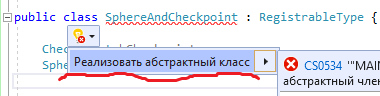

# Объединения

Версия 7.4 дарит очередной инструмент — **Union**. По названию понятно, что речь пойдёт об объединениях. Давайте теперь детальнее расскажу что это и как использовать.


Рекомендую для начала ознакомится со статьями [Добавление команд](commands.md) и [Методы расширения](extensions.md)!


C# позволяет создавать собственные типы данных (классы, структуры, интерфейсы и т.п.). Но их использование может затруднить генератор, так как в собственные типы не умеют перехватывать процедуру автоматической инициализации. Этот класс позволяет это сделать!

Главная идея этого класса — объединить несколько переменных (в том числе разных типов). Хорошим примером может стать объединение переменных типов **Checkpoint** и **Sphere**, так как они очень часто используются вместе. А дальше уже написать несколько методов, которые используются чаще всего.

### Создание пользовательского типа

Для того, чтобы объединить наши типы, нам нужно создать класс, который наследует `Union` :

```csharp
public partial class MAIN {

    public class SphereAndCheckpoint : Union {
    
        Checkpoint hCheckpoint;
        Sphere hSphere;
    
        // ...
    
    }
    
}
```

Переменные **hCheckpoint** и **hSphere** пока не инициализированы, так как мы не сможем заранее узнать где наш класс **SphereAndCheckpoint** будет создан. Поэтому класс **Union** требует реализации методов `OnGlobalAutoInit` и `OnLocalAutoInit` (они абстрактные). Реализуем абстрактный класс:



Из названий этих методов понятно, что они вызываются тогда, когда объект нашего типа будет иметь локальный или глобальный контекст (будет глобальным, если применить модификатор `static`). Нам останется только инициализировать поля нашего класса в этих методах:

```csharp
public partial class MAIN {
    
    public class SphereAndCheckpoint : Union {
    
        Checkpoint hCheckpoint;
        Sphere hSphere;
    
        protected override void OnGlobalAutoInit() {
            hCheckpoint = global(); // следующая глобальная переменная
            hSphere = global(); // следующая глобальная переменная
        }
    
        protected override void OnLocalAutoInit() {
            hCheckpoint = local(); // следующая локальная переменная
            hSphere = local(); // следующая локальная переменная
        }
    
    }
    
}
```

Наш класс успешно создан! Давайте добавим ещё 2 метода, чтобы было не так скучно:

```csharp
public partial class MAIN {
    
    public class SphereAndCheckpoint : Union {
    
        // ...
    
        public void create( Float x, Float y, Float z, Float radius ) {
            hCheckpoint.create( x, y, z );
            hSphere.create( x, y, z, radius );
        }
    
        public void remove() {
            hCheckpoint.disable();
            hSphere.destroy();
        }
    
    }
    
}
```

Теперь лучше. Как же это "чудо использовать"? А вот вам примерчик:

```csharp
public partial class MAIN {
    
    public class TEST : Thread {
    
        //static SphereAndCheckpoint globalSphereAndCheckpoint;
        SphereAndCheckpoint localSphereAndCheckpoint;
    
        public override void START( LabelJump label ) {
            
            localSphereAndCheckpoint.create( 0.0, 0.0, 0.0, 2.0 );
            wait( 10000 );
            localSphereAndCheckpoint.remove();
            
            end_thread();
        }
    
    }
    
}
```

Теперь переменная **localSphereAndCheckpoint** не требует инициализации (`new SphereAndCheckpoint()`), а методы работают одновременно со сферой и маркером! Вот результат:

```
//------------- THREAD TEST ---------------
:TEST
03A4: name_thread 'TEST'
018A: 0@ = create_checkpoint_at 0.0 0.0 0.0
03BC: 1@ = create_sphere_at 0.0 0.0 0.0 radius 2.0
0001: wait 10000 ms
0164: disable_marker 0@
03BD: destroy_sphere 1@
004E: end_thread
```

Лучше всего делать объединения переменных, которые изначально требуют инициализации.
