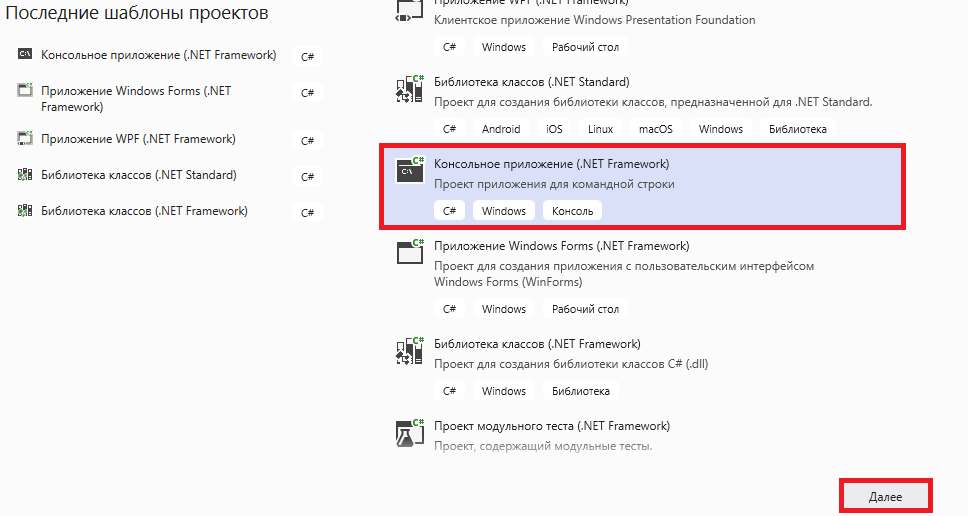
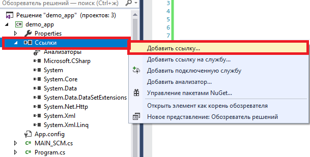
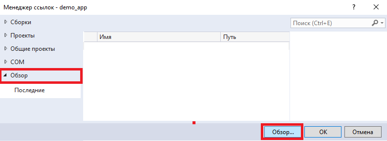
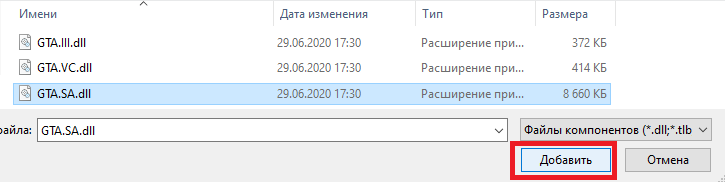
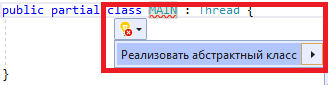
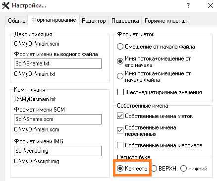

# Установка и настройка

### Установка

Установки, как таковой, не требуется. Вам нужно только создать любой проект в `Visual Studio` с поддержкой `C#`. Для примера я создам обычное консольное приложение. Имя может быть абсолютно любым. Обратите внимание, что проект должен использовать шаблон `.Net Framework`: &#x20;



Далее добавьте ссылку на библиотеку, используя меню `Ссылки->Добавить ссылку`: &#x20;



После этого нажмите на кнопку **Обзор** и укажите путь к`GTA.III.dll`, `GTA.VC.dll`, `GTA.SA.dll`, `GTA.III.CLEO.dll`, `GTA.VC.CLEO.dll` или `GTA.SA.CLEO.dll`.





Далее нажмите **Ок** в окне **Менеджер ссылок**: &#x20;

### Настройка

После успешного выполнения этих действий, можно приступить к написанию кода. Откроем созданный проект и в методе `Main` будем настраивать генератор:

```csharp
using GTA.Core; // подключим пространство имён генератора
using System; // нужно только для доступа к стандартному классу "Console"

namespace demo_app {

    class Program {

        static void Main( string[] args ) {

            // указываем язык вывода ошибок, если нужно
            Generator.Language = Language.RU;
		
            Console.ReadKey(); // ставим задержку консоли, чтобы дать возможность генератору закончить работу

        }

    }

}
```

Приведённый код только настраивает генератор, но этого делать не обязательно, так как он уже используют значения по умолчанию. Сейчас нас интересует как запустить генератор. Нам необходимо создать класс с названием `MAIN` (**CTRL**+**ALT**+**C** или через меню). Сначала подключим пространства имён, которые нужны для генерации скрипта:

```csharp
using GTA; // подключаем типы данных и команды, которые используются в GTA. Они зависят от выбранной библиотеки

public partial class MAIN : Thread { // "partial" писать желательно

    public override void START( LabelJump label ) { // этот метод является точкой старта скрипта

    }

}
```

Класс **MAIN** должен наследовать класс `Thread`. Этот класс содержит функции, которые имеют такие же названия, как и опкоды в Sanny Builder.

Поскольку метод `START` является абстрактным, нам нужно его написать вручную или использовав подсказки Visual Studio (установите курсор на имя класса и подождите пока не появится кнопка с меню в виде лампочки **Реализовать абстрактный класс**): &#x20;



Теперь возвращаемся к консольному проекту, и запускаем генератор, указав класс (что мы создали ранее) между символами `<`и`>`:

```csharp
using GTA.Core;
using System;

namespace demo_app {

    class Program {

        static void Main( string[] args ) {
		
            Generator.Start<MAIN>( true ); // запускаем генератор!

            Console.ReadKey();
        }

    }

}
```

В методе запуска генератора я использовал параметр **true**, который после генерации кода откроет результат в текстовом редакторе. Этот параметр является опциональным. Если файл не нужно открывать, то укажите **false**. В режиме CLEO этот параметр всегда игнорируется!

### Компиляция скриптов

Генератор не умеет самостоятельно компилировать скрипты, однако есть поддержка использования компилятора Sanny Builder. Для этого нужно вместо метода **Generator.Start** использовать функцию `Generator.Compile`:

```csharp
namespace demo_app {

    class Program {

        static void Main( string[] args ) {


            // Куда сохранять FXT-файлы
            Generator.SetFXTFolder( @"D:\Programm\GTA_SA Career v2.0\modloader\wmysterio\cleo\cleo_text" );

            // Куда сохранять SCM- и IMG-файлы
            Generator.SetMainSCMFolder( @"D:\Programm\GTA_SA Career v2.0\modloader\wmysterio\data\script" );
            
            // Для CLEO надо использовать путь к игре!
            //Generator.SetGTAFolder( @"D:\Programm\GTA_SA Career v2.0" );
            
            // Путь к "sanny.exe"
            Generator.SetSannyBuidlerFolder( @"D:\Programm\Sanny Builder 3" );

            Generator.Compile<MAIN>( false );

            Console.ReadKey();

        }

    }

}
```

Перед компиляцией нужно указать пути, куда будут перемещаться созданные файлы. Всё остальное будет сделано автоматически. Метод `Compile` принимает опциональный параметр, который будет открывать Sanny Builder после компиляции. В режиме CLEO метод **SetMainSCMFolder** не используется. Вместо него надо указывать путь к игре через метод `SetGTAFolder`.

### Настройка Sanny Builder

Генератор работает только с **Sanny Builder** версии **3.5.1**! Чтобы избежать возможных конфликтов, нам нужно настроить сам Sanny Builder и убедиться, что всё готово к его запуску. В настройках форматирования установите значение `Как есть`: &#x20;



Подготовка к созданию первого скрипта завершена!
